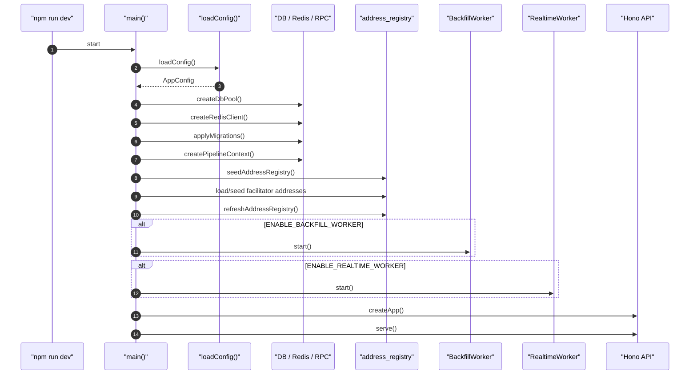
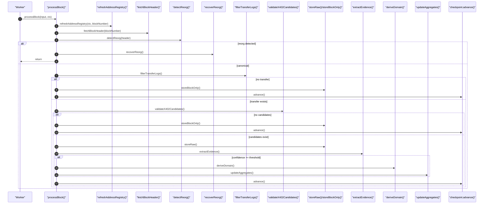
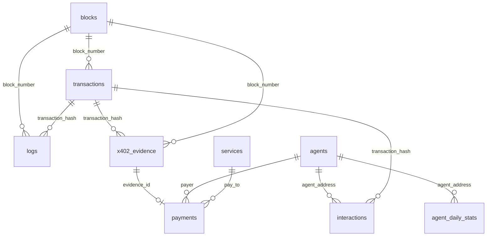

# x402-indexer 전체 로직 설명서

이 문서는 `x402-indexer`를 처음 보는 사람에게 코드 실행 흐름, x402 결제 판별 방식, DB 테이블 관계를 설명하기 위한 문서다.

표기 방식은 아래처럼 통일한다.

```text
영어키워드(한국어 설명)
```

예를 들어 `worker(블록 처리 일꾼)`, `evidence(x402 판단 근거)`, `checkpoint(어디까지 처리했는지 기록)`처럼 읽으면 된다.

## 1. 이 프로젝트를 한 문장으로 설명하면

`x402-indexer(체인 데이터 수집기)`는 Base 체인에서 x402 결제처럼 보이는 온체인 기록을 찾아 PostgreSQL(DB)에 저장하고, API/UI에서 조회할 수 있게 만드는 프로그램이다.

조금 더 풀면:

> Base 블록을 읽으면서 `known asset(알려진 결제 토큰)`의 ERC-20 `Transfer(토큰 이동 이벤트)`를 먼저 찾고, 그 `Transfer(토큰 이동)`가 EIP-3009 기반 x402 결제인지 `transaction input(트랜잭션 호출 데이터)`, `receipt log(실행 결과 이벤트)`, `facilitator(결제 제출 대행자)`, `calldata match(호출 데이터와 실제 토큰 이동의 일치 여부)`로 점수화한 뒤, 기준을 넘는 것만 `payment(확정 결제)`와 `stats(통계)`로 승격하는 시스템이다.

이 프로젝트는 모든 체인 데이터를 저장하는 범용 인덱서가 아니다. x402 결제 후보를 찾는 데 필요한 데이터만 단계적으로 좁혀 저장한다.

전체 흐름은 이렇게 보면 된다.

```text
Base RPC(체인 조회 통로)
  -> RealtimeWorker(새 블록 감시 일꾼) / BackfillWorker(과거/누락 블록 재처리 일꾼)
    -> processBlock(블록 하나 처리하기)
      -> pipeline steps(블록 처리 단계들)
        -> PostgreSQL(DB 저장소)
          -> Hono API(조회 API) / UI(화면)
```

## 2. 핵심 용어 번역표

| 코드 용어 | 한국어로 이해 |
|---|---|
| `indexer` | 체인 데이터를 읽어서 DB에 정리하는 수집기 |
| `worker` | 블록 처리 일꾼 |
| `realtime worker` | 새 블록 감시 일꾼 |
| `backfill worker` | 과거/누락 블록 재처리 일꾼 |
| `pipeline` | 블록 하나를 처리하는 단계 묶음 |
| `processBlock` | 블록 하나 처리하기 |
| `candidate` | x402일 가능성이 있는 후보 |
| `evidence` | x402라고 볼 수 있는 근거 |
| `confidence` | x402라고 믿을 수 있는 점수 |
| `threshold` | 기준점 |
| `promote` | 확정 데이터로 승격 |
| `payment` | 확정 결제 |
| `payer` | 돈 낸 주소 |
| `payTo` | 돈 받은 주소 |
| `agent` | 돈 낸 주소를 도메인으로 부르는 이름 |
| `service` | 돈 받은 주소를 도메인으로 부르는 이름 |
| `facilitator` | 결제 제출 대행자 |
| `proxy` | 대신 호출되는 중간 컨트랙트 |
| `registry` | 중요 주소 목록 |
| `checkpoint` | 어디까지 처리했는지 기록 |
| `reorg` | 체인 재편성 |
| `orphan block` | 체인 재편성으로 밀려난 블록 |
| `raw data` | 가공 전 원본에 가까운 데이터 |
| `aggregate` | 합계/통계 계산 |
| `enrichment` | 부가 정보 보강 |
| `selector` | 어떤 함수를 호출했는지 나타내는 4바이트 코드 |
| `receipt` | 트랜잭션 실행 결과표 |
| `log/event` | 컨트랙트가 남긴 이벤트 기록 |
| `finality lag` | 블록 확정을 기다리는 지연 블록 수 |
| `cursor lock` | 동시에 같은 처리 위치를 건드리지 못하게 하는 잠금 |

## 3. 왜 x402 판별이 단순하지 않은가

x402 결제에서는 실제 돈을 낸 사람과 트랜잭션을 체인에 제출한 사람이 다를 수 있다.

일반적인 온체인 결제라면 `tx.from(트랜잭션 보낸 주소)`를 `payer(돈 낸 주소)`로 봐도 되는 경우가 많다. 하지만 x402에서는 사용자가 결제 허가 서명을 만들고, `facilitator(결제 제출 대행자)`가 그 서명을 체인에 제출할 수 있다.

그래서 아래 구분이 가장 중요하다.

```text
tx.from
  = 트랜잭션을 체인에 제출한 주소
  = facilitator(결제 제출 대행자)일 수 있음

Transfer.from
  = 실제 토큰을 낸 주소
  = 진짜 payer(돈 낸 주소)

Transfer.to
  = 실제 토큰을 받은 주소
  = payTo(돈 받은 주소) 또는 service(서비스 주소)
```

이 프로젝트는 `payer(돈 낸 주소)`를 `tx.from`에서 가져오지 않는다. `x402_evidence(x402 판단 근거)`를 만들 때 `payer`는 ERC-20 `Transfer.from`, `payTo`는 `Transfer.to`를 사용한다.

관련 파일:

- `src/pipeline/steps/filterTransferLogs.ts`
- `src/pipeline/steps/validateX402Candidate.ts`
- `src/pipeline/steps/extractEvidence.ts`

## 4. 실행 시작 흐름

앱 실행 진입점은 `src/index.ts`의 `main()`이다.

실행하면 아래 순서로 부팅된다.

```text
1. .env 로드 및 config(설정) 검증
2. PostgreSQL Pool(DB 연결 풀) 생성
3. Redis client(Redis 연결) 생성
4. migration(DB 스키마 생성/수정 SQL) 적용
5. viem Base RPC client(Base 체인 조회 클라이언트) 생성
6. PipelineContext(파이프라인 공용 의존성 묶음) 생성
7. address_registry(중요 주소 목록) seed(초기 등록)
8. facilitator source(외부 facilitator 목록) 동기화
9. in-memory registry(메모리 중요 주소 목록) refresh(새로고침)
10. BackfillWorker(과거/누락 블록 재처리 일꾼) 시작
11. RealtimeWorker(새 블록 감시 일꾼) 시작
12. Hono API(API 서버) 시작
```

Mermaid로 보면:



여기서 `PipelineContext(파이프라인 공용 의존성 묶음)`가 중요하다. worker와 pipeline step들은 DB, Redis, RPC, registry, config를 직접 새로 만들지 않고 이 context를 주입받아 사용한다.

관련 파일:

- `src/index.ts`
- `src/config.ts`
- `src/db/client.ts`
- `src/pipeline/types.ts`

## 5. Worker(일꾼)는 블록 번호를 공급하고, processBlock(블록 처리 함수)이 실제 인덱싱한다

이 프로젝트에는 두 종류의 `worker(블록 처리 일꾼)`가 있다.

```text
RealtimeWorker(새 블록 감시 일꾼)
  = 새 블록이 생기는지 감시한다.

BackfillWorker(과거/누락 블록 재처리 일꾼)
  = 누락된 블록이나 과거 범위를 다시 처리한다.
```

두 worker의 목적은 다르지만 실제 블록 처리 함수는 같다.

```text
RealtimeWorker.handle()
  -> processBlock({ source: "realtime" })

BackfillWorker.handle()
  -> processBlock({ source: "backfill" })
```

즉 worker는 "어떤 블록 번호를 처리할지" 결정하고, 진짜 인덱싱 로직은 `processBlock(블록 하나 처리하기)`에 모여 있다.

## 6. RealtimeWorker(새 블록 감시 일꾼)

`RealtimeWorker`는 viem `watchBlocks(새 블록 감시)`로 새 블록을 본다. 새 블록을 받았다고 바로 처리하지 않고 `FINALITY_LAG(확정 대기 블록 수)`만큼 기다린 뒤 내부 queue(대기열)에 넣는다.

흐름:

```text
watchBlocks onBlock(새 블록 콜백)
  -> onNewBlock(blockNumber)
    -> waitForFinality(확정 대기)
    -> queue.push(blockNumber)
      -> consumeLoop(대기열 소비 루프)
        -> handle(blockNumber)
          -> withCursorLock(처리 위치 잠금)
            -> processBlock(블록 하나 처리)
```

실시간 워커의 안전장치는 두 가지다.

첫째, `finality lag(확정 대기)`를 기다린다. 너무 최신 블록을 바로 처리하면 `reorg(체인 재편성)` 가능성이 커지기 때문이다.

둘째, `checkpoint gap(처리 위치 공백)`이 있으면 직접 이어서 처리하지 않고 `backfill(재처리)`에 위임한다. 예를 들어 realtime checkpoint가 10인데 갑자기 13번 블록이 들어오면 11~13 범위를 backfill로 넘긴다.

관련 파일:

- `src/workers/realtimeWorker.ts`

## 7. BackfillWorker(과거/누락 블록 재처리 일꾼)

`BackfillWorker`는 BullMQ 기반이다. API, realtime gap, reorg 복구에서 특정 block range(블록 범위)를 enqueue(큐에 등록)하면 이 worker가 처리한다.

흐름:

```text
enqueue({ startBlock, endBlock })
  -> recordQueuedBackfillJob(DB에 백필 작업 기록)
  -> BullMQ queue.add(큐에 작업 추가)
    -> processJob(작업 처리)
      -> splitIntoChunks(범위를 작은 덩어리로 나눔)
        -> for each block(블록별 반복)
          -> isAlreadyProcessed(이미 처리됐는지 확인)
          -> handle()
            -> withCursorLock(처리 위치 잠금)
              -> processBlock(블록 하나 처리)
```

긴 범위를 한 번에 처리하지 않고 `chunk(작은 블록 범위)`로 쪼개는 이유는 실패했을 때 재시도 범위와 진행 상태를 좁히기 위해서다.

관련 파일:

- `src/workers/backfillWorker.ts`
- `src/db/backfillJobs.ts`

## 8. Cursor lock(처리 위치 잠금)과 checkpoint(처리 위치 기록)

인덱서는 블록을 순서대로 처리해야 한다. realtime과 backfill이 동시에 같은 위치를 건드리면 `checkpoint(어디까지 처리했는지 기록)`가 꼬일 수 있다.

그래서 worker는 `processBlock()`을 직접 호출하지 않고 `withCursorLock(처리 위치 잠금)`으로 감싼다.

```text
withCursorLock(workerName, ctx, fn)
  -> CheckpointManager.acquireLock(잠금 획득)
  -> fn()
  -> CheckpointManager.releaseLock(잠금 해제)
```

현재 구현은 PostgreSQL `sync_checkpoints` row를 `SELECT ... FOR UPDATE NOWAIT`로 잠그는 방식이다. lock을 못 잡으면 다른 worker가 처리 중이라는 뜻이므로 null을 반환하고 넘어간다.

checkpoint에는 두 값이 중요하다.

```text
last_processed_block(마지막 처리 블록 번호)
last_processed_hash(마지막 처리 블록 해시)
```

hash까지 저장하는 이유는 `reorg(체인 재편성)`를 감지하기 위해서다. 새 블록의 `parentHash(부모 블록 해시)`가 checkpoint hash와 다르면 로컬 처리 상태와 canonical chain(정식 체인)이 어긋난 것이다.

관련 파일:

- `src/db/checkpoints.ts`
- `src/pipeline/steps/detectReorg.ts`

## 9. processBlock(블록 하나 처리하기) 전체 흐름

`processBlock()`은 단일 블록 처리의 메인 파이프라인이다.

흐름:

```text
processBlock(input, ctx)
  -> refreshAddressRegistry(ctx, blockNumber)
     현재 블록 높이에 맞는 중요 주소 목록 새로고침

  -> fetchBlockHeader(blockNumber)
     블록 번호, 해시, 부모 해시, 시간을 가져옴

  -> detectReorg(header)
     체인 재편성 여부 확인

  -> reorg면 recoverReorg() 후 return
     밀려난 데이터 복구 처리 후 현재 블록은 다음 사이클에서 다시 처리

  -> filterTransferLogs(header)
     known asset의 Transfer 이벤트만 조회

  -> Transfer 없으면 storeBlockOnly() 후 checkpoint advance
     후보 없는 블록도 reorg 비교를 위해 블록 헤더는 저장

  -> validateX402Candidates(transferLogs)
     Transfer가 x402 후보인지 검사

  -> 후보 없으면 storeBlockOnly() 후 checkpoint advance

  -> storeRaw(header, candidates)
     blocks / transactions / logs 원본 계층 저장

  -> extractEvidence(candidates)
     x402 판단 근거와 confidence 점수 저장

  -> confidence threshold 이상만 promoted
     기준 이상만 확정 결제로 승격

  -> deriveDomain(promoted)
     agents / services / payments / interactions 생성

  -> updateAggregates(promoted)
     USD 환산, 일별 통계, selector 이름 보강

  -> checkpoint.advance()
     모든 단계가 성공한 뒤 어디까지 처리했는지 갱신
```

Mermaid:



관련 파일:

- `src/pipeline/orchestrator.ts`

## 10. x402 candidate(x402 후보)를 찾는 방식

이 인덱서는 x402를 처음부터 직접 찾지 않는다. 가장 싼 신호부터 시작해서 점점 비싼 확인으로 들어간다.

### 10.1 1차 필터: known asset(알려진 결제 토큰)의 Transfer(토큰 이동 이벤트)

첫 번째 필터는 known asset에서 발생한 ERC-20 `Transfer(토큰 이동 이벤트)`다.

예를 들어 Base USDC 주소가 `knownAssets(알려진 결제 토큰 목록)`에 들어 있다면 해당 컨트랙트의 Transfer 이벤트만 가져온다.

Transfer부터 보는 이유:

```text
1. ERC-20 결제라면 결국 Transfer 이벤트가 발생한다.
2. getLogs(로그 조회)는 transaction 전체를 훑는 것보다 싸다.
3. x402가 아닌 일반 USDC 송금도 섞이지만 후보 범위를 크게 줄일 수 있다.
```

Transfer가 없으면 그 블록은 x402 결제 후보가 없다고 보고 block header만 저장한다.

관련 파일:

- `src/pipeline/steps/filterTransferLogs.ts`

### 10.2 2차 필터: EIP-3009 selector(함수 식별 코드)

Transfer 로그가 있으면 해당 transaction(트랜잭션)과 receipt(실행 결과표)를 조회한다.

그 다음 `transaction input(트랜잭션 호출 데이터)` 앞 4 bytes selector를 확인한다.

현재 허용하는 selector:

```text
0xe3ee160e = transferWithAuthorization(서명 기반 전송)
0xef55bec6 = receiveWithAuthorization(서명 기반 수령)
```

x402 EVM exact payment는 USDC EIP-3009 authorization 흐름과 잘 맞기 때문에 이 selector들이 강한 후보 신호가 된다.

관련 파일:

- `src/pipeline/steps/validateX402Candidate.ts`

### 10.3 3차 필터: tx.to(트랜잭션 대상)가 known asset/proxy인지 확인

selector가 맞아도 아무 컨트랙트 호출이나 x402라고 볼 수는 없다.

그래서 `tx.to(트랜잭션 대상 주소)`가 다음 중 하나인지 확인한다.

```text
knownAssets(알려진 결제 토큰)
  = USDC 같은 결제 자산

knownProxies(알려진 중간 컨트랙트)
  = x402 permit/proxy contract
```

즉 이 transaction이 실제 결제 자산이나 결제 proxy를 향하고 있어야 candidate가 된다.

### 10.4 facilitator(결제 제출 대행자) 필터

`facilitator(결제 제출 대행자)`는 사용자의 authorization(결제 허가 서명)을 대신 제출하는 주소다.

이 프로젝트는 facilitator를 두 모드로 다룬다.

```text
soft mode(느슨한 모드)
  = facilitator가 몰라도 후보로 남긴다. 대신 confidence 점수가 낮다.

hard mode(엄격한 모드)
  = known facilitator가 아니면 후보에서 제외한다.
```

기본 관점은 soft mode에 가깝다. 실제 x402 트랜잭션에서 facilitator registry가 완전하지 않을 수 있기 때문이다.

## 11. evidence(근거)와 confidence(신뢰 점수)

candidate(후보)가 됐다고 바로 `payments(확정 결제)`에 들어가지 않는다. 먼저 `x402_evidence(x402 판단 근거)`에 저장된다.

이 테이블은 "확정 결제"가 아니라 "x402일 가능성이 있는 근거"다.

confidence 계산은 점수 더하기 방식이다.

```text
known facilitator match(알려진 제출 대행자와 일치)      +40
AuthorizationUsed event exists(허가 사용 이벤트 존재)    +30
direct/proxy method clear(직접/프록시 경로가 명확)        +20
calldata matches Transfer(호출 데이터와 Transfer 일치)    +20
receipt success(트랜잭션 성공)                            +10
max score(최대 점수)                                      100
```

예를 들어 facilitator를 모르더라도 아래 조건을 만족하면 높은 점수를 받을 수 있다.

```text
AuthorizationUsed 이벤트 있음
tx.to가 known asset
calldata의 from/to/value가 Transfer 로그와 일치
receipt가 success
```

이 구조가 중요한 이유는 "의심 기록 보존"과 "확정 결제 저장"을 분리하기 위해서다.

```text
low confidence evidence(낮은 점수의 근거)
  -> x402_evidence에는 저장
  -> payments에는 승격하지 않음

high confidence evidence(높은 점수의 근거)
  -> x402_evidence 저장
  -> payments/domain/stats로 승격
```

관련 파일:

- `src/pipeline/steps/extractEvidence.ts`

## 12. promote(승격)와 domain table(도메인 테이블)

confidence가 threshold 이상이면 `deriveDomain(도메인 데이터 만들기)`이 실행된다.

여기서 evidence는 다음 domain table로 파생된다.

```text
agents(돈 낸 주소 목록)
services(돈 받은 주소 목록)
payments(확정 결제 목록)
interactions(호출 상호작용 기록)
```

순서가 중요하다.

```text
1. payer가 agents에 없으면 getBytecode로 EOA/contract 여부 확인
2. agents upsert(있으면 갱신, 없으면 삽입)
3. services upsert
4. payments insert/update
5. interactions insert
```

`payments.payer(결제의 돈 낸 주소)`가 `agents.address`를 참조하고, `payments.pay_to(결제의 돈 받은 주소)`가 `services.address`를 참조하므로, payment를 넣기 전에 agents/services가 먼저 있어야 한다.

관련 파일:

- `src/pipeline/steps/deriveDomain.ts`

## 13. aggregate(통계 계산)와 enrichment(부가 정보 보강)

`updateAggregates(통계/부가정보 갱신)`는 payment 저장 이후 조회용 데이터를 보강한다.

하는 일은 크게 세 가지다.

```text
1. payment 금액을 USD로 환산
2. agent_daily_stats(주소별 하루 통계) 재계산
3. function selector(함수 식별 코드) 이름 보강
```

가격은 DeFiLlama historical price API를 hour bucket(시간 단위 묶음) 기준으로 조회하고 `price_snapshots(가격 캐시)`에 저장한다.

현재 결제 금액 환산은 USDC 6 decimals 전제다.

```text
amount_usd = amount / 1_000_000 * token_price
```

`agent_daily_stats(주소별 하루 통계)`는 단순히 기존 값에 더하는 방식이 아니다. 영향받은 `agent/date(주소/날짜)`를 다시 계산한다.

이렇게 하는 이유:

```text
1. 같은 블록/날짜를 재처리해도 중복 집계가 덜 생긴다.
2. reorg(체인 재편성) 후 삭제/재계산이 가능하다.
3. 가격 캐시가 바뀌어도 재계산 구조가 자연스럽다.
```

관련 파일:

- `src/pipeline/steps/aggregate.ts`
- `src/pipeline/steps/dailyStats.ts`
- `src/pipeline/steps/priceCache.ts`

## 14. DB 테이블을 층으로 이해하기

DB는 아래 층으로 나누면 이해하기 쉽다.

```text
운영/설정 layer(운영과 설정을 위한 테이블)
  address_registry
  sync_checkpoints
  backfill_jobs

raw layer(원본에 가까운 데이터)
  blocks
  transactions
  logs

evidence layer(x402 판단 근거)
  x402_evidence

domain layer(서비스가 이해하기 쉬운 데이터)
  agents
  services
  payments
  interactions

aggregate/enrichment layer(통계와 부가정보)
  agent_daily_stats
  price_snapshots
  function_signatures
```

스키마 파일:

- `src/db/migrations/0001_init.sql`

## 15. DB 관계를 큰 그림으로 보면



문장으로 풀면:

```text
blocks(블록)
  -> transactions(후보 트랜잭션)
    -> logs(이벤트 로그)
    -> x402_evidence(x402 판단 근거)
      -> payments(확정 결제)
        -> agent_daily_stats(주소별 하루 통계)
```

핵심은 `x402_evidence(판단 근거)`와 `payments(확정 결제)`가 분리되어 있다는 점이다.

## 16. 운영/설정 테이블

### 16.1 address_registry(중요 주소 목록)

역할:

`address_registry`는 인덱서가 어떤 주소를 중요하게 볼지 저장하는 테이블이다.

주요 컬럼:

```text
address(주소)
type(주소 종류) = asset / facilitator / proxy
name(사람이 알아보기 위한 이름)
valid_from_block(유효 시작 블록)
valid_to_block(유효 종료 블록)
```

왜 필요한가:

```text
asset(결제 토큰)
  -> Transfer 로그 필터에 사용

facilitator(결제 제출 대행자)
  -> confidence 점수에 사용

proxy(중간 컨트랙트)
  -> permit/proxy 경로 판별에 사용
```

`valid_from_block`, `valid_to_block`이 있는 이유는 backfill(과거 블록 재처리) 때문이다. 과거 블록을 처리할 때 현재 주소 목록이 아니라 그 블록 높이에서 유효했던 주소만 써야 한다.

예:

```text
어떤 facilitator가 100번 블록부터 유효했다면,
50번 블록을 backfill할 때 그 facilitator를 known facilitator로 보면 안 된다.
```

관련 코드:

- `src/db/addressRegistry.ts`
- `src/db/facilitatorSource.ts`
- `src/db/api-queries.ts`

### 16.2 sync_checkpoints(처리 위치 기록)

역할:

worker별 마지막 처리 위치를 저장한다.

주요 컬럼:

```text
worker_name(일꾼 이름)
last_processed_block(마지막 처리 블록 번호)
last_processed_hash(마지막 처리 블록 해시)
status(상태)
updated_at(갱신 시간)
```

왜 hash까지 저장하나:

블록 번호만 저장하면 reorg를 감지할 수 없다. 다음 블록을 처리할 때 아래 비교를 한다.

```text
header.parentHash == last_processed_hash
```

일치하면 정상적으로 이어진 블록이고, 아니면 reorg 가능성이 있다.

관계키:

`worker_name`이 primary key다. worker별 cursor(처리 위치)가 하나씩 있기 때문이다.

관련 코드:

- `src/db/checkpoints.ts`
- `src/pipeline/steps/detectReorg.ts`

### 16.3 backfill_jobs(재처리 작업 목록)

역할:

백필 요청 범위와 상태를 기록한다.

주요 컬럼:

```text
start_block(시작 블록)
end_block(끝 블록)
status(상태)
retry_count(재시도 횟수)
error_message(오류 메시지)
```

왜 BullMQ만 쓰지 않고 DB에도 남기나:

BullMQ queue가 비활성화되어 있거나 enqueue에 실패해도, 어떤 범위를 재처리해야 하는지 운영자가 알 수 있어야 한다.

`(start_block, end_block)`에 unique index가 있는 이유는 같은 범위가 중복 등록되는 것을 막기 위해서다.

관련 코드:

- `src/db/backfillJobs.ts`
- `src/workers/backfillWorker.ts`

## 17. Raw layer(원본에 가까운 데이터)

### 17.1 blocks(블록 정보)

역할:

처리한 block header(블록 헤더)를 저장한다.

주요 컬럼:

```text
number(블록 번호) = primary key
hash(블록 해시) = unique
parent_hash(부모 블록 해시)
timestamp(블록 시간)
is_orphaned(체인 재편성으로 밀려났는지 여부)
```

왜 후보가 없는 블록도 저장하나:

후보가 없는 블록도 checkpoint와 reorg 검사를 위해 필요하다. 다음 블록의 `parentHash`를 비교하려면 이전 블록 hash가 DB/checkpoint에 있어야 한다.

관계키:

```text
transactions.block_number -> blocks.number
logs.block_number -> blocks.number
x402_evidence.block_number -> blocks.number
payments.block_number -> blocks.number
interactions.block_number -> blocks.number
```

주의:

현재 schema는 `blocks.number`가 primary key라 같은 height(블록 높이)의 orphan block과 canonical block을 동시에 완전 보존하기 어렵다. reorg raw preservation과 관련된 리뷰 포인트가 이 지점에서 나온다.

관련 코드:

- `src/pipeline/steps/storeRaw.ts`
- `src/pipeline/steps/recoverReorg.ts`

### 17.2 transactions(후보 트랜잭션 정보)

역할:

x402 candidate(후보)가 된 transaction의 raw 정보를 저장한다.

주요 컬럼:

```text
hash(트랜잭션 해시)
block_number(소속 블록 번호)
from_address(트랜잭션 제출 주소)
to_address(트랜잭션 대상 주소)
input(호출 데이터)
value(네이티브 토큰 값)
status(성공/실패)
gas_used(사용한 가스)
effective_gas_price(실제 가스 가격)
```

왜 모든 트랜잭션을 저장하지 않나:

이 프로젝트는 범용 chain indexer가 아니라 x402 indexer다. 따라서 known asset Transfer가 있고 x402 candidate로 볼 수 있는 transaction만 저장한다.

왜 `input(호출 데이터)`을 저장하나:

```text
1. EIP-3009 selector 확인
2. calldata from/to/value 검증
3. function selector 분석
```

왜 gas 정보를 저장하나:

`agent_daily_stats.total_gas_usd(주소별 하루 가스비 USD)` 계산에 필요하다.

관계키:

```text
transactions.block_number -> blocks.number
logs.transaction_hash -> transactions.hash
x402_evidence.transaction_hash -> transactions.hash
interactions.transaction_hash -> transactions.hash
```

관련 코드:

- `src/pipeline/steps/storeRaw.ts`
- `src/pipeline/steps/deriveDomain.ts`
- `src/pipeline/steps/dailyStats.ts`

### 17.3 logs(이벤트 로그)

역할:

candidate transaction의 receipt logs(실행 결과 이벤트들)를 저장한다.

주요 컬럼:

```text
transaction_hash(트랜잭션 해시)
log_index(트랜잭션 안에서 이벤트 순서)
block_number(블록 번호)
address(이벤트를 낸 컨트랙트 주소)
topic0~topic3(이벤트 주제 값)
data(이벤트 데이터)
```

왜 `(transaction_hash, log_index)`가 unique인가:

한 transaction 안에서 log index는 이벤트를 식별하는 고유 번호다. 따라서 이 조합이 같은 이벤트의 자연키 역할을 한다.

왜 topic/data를 그대로 저장하나:

나중에 Transfer, AuthorizationUsed, custom event를 다시 검증하거나 디버깅할 수 있게 하기 위해서다.

관계키:

```text
logs.transaction_hash -> transactions.hash
logs.block_number -> blocks.number
```

관련 코드:

- `src/pipeline/steps/storeRaw.ts`

## 18. Evidence layer(x402 판단 근거)

### 18.1 x402_evidence(x402 의심/근거 기록)

역할:

x402 결제일 가능성이 있는 근거를 저장한다.

주요 컬럼:

```text
id(근거 ID)
transaction_hash(트랜잭션 해시)
log_index(토큰 이동 로그 번호)
block_number(블록 번호)
detection_method(감지 방식)
confidence(신뢰 점수)
payer(돈 낸 주소)
pay_to(돈 받은 주소)
asset(결제 토큰)
amount(결제 수량)
```

이 테이블이 중요한 이유:

`x402_evidence`는 "확정 결제"가 아니다. "이 transaction/log가 x402일 가능성이 있다"는 판단 근거다.

왜 payments와 분리하나:

confidence threshold보다 낮은 것은 payment로 올리면 안 된다. 하지만 완전히 버리면 나중에 정책 변경이나 디버깅을 할 수 없다. 그래서 evidence로는 보관하고, 기준을 넘는 것만 payments로 승격한다.

왜 `(transaction_hash, log_index)`가 unique인가:

같은 transaction 안에 Transfer 로그가 여러 개 있을 수 있다. 각각이 별도 결제 후보가 될 수 있으므로 transaction hash만으로는 부족하고 log index까지 포함해야 한다.

왜 payer/pay_to/amount를 따로 저장하나:

이 값들은 Transfer 로그에서 온 x402 판단의 핵심 결과다. 나중에 raw logs를 다시 디코딩하지 않아도 evidence row만 보면 누가 누구에게 얼마를 보냈는지 알 수 있다.

관계키:

```text
x402_evidence.transaction_hash -> transactions.hash
x402_evidence.block_number -> blocks.number
payments.evidence_id -> x402_evidence.id
```

관련 코드:

- `src/pipeline/steps/extractEvidence.ts`
- `src/pipeline/steps/deriveDomain.ts`

## 19. Domain layer(서비스가 이해하기 쉬운 데이터)

### 19.1 agents(돈 낸 주소 목록)

역할:

실제 payer(돈 낸 주소)를 저장한다.

주요 컬럼:

```text
address(주소)
is_contract(컨트랙트 주소인지 여부)
first_seen_block(처음 관측된 블록)
last_seen_block(마지막 관측된 블록)
```

왜 payer를 agent라고 부르나:

이 프로젝트의 분석 대상은 "x402를 통해 결제 활동을 하는 주소"다. 그 주소가 EOA(일반 지갑)일 수도 있고 contract wallet/agent(컨트랙트 지갑/자동화 주체)일 수도 있어서 `agents`라는 도메인 이름을 쓴다.

왜 `is_contract`가 있나:

주소가 EOA인지 contract인지 구분하면 자동화 agent/contract wallet 분석에 도움이 된다. 신규 payer는 `getBytecode(바이트코드 조회)`로 code 존재 여부를 확인한다.

왜 first/last seen block이 FK인가:

agent가 처음/마지막으로 관측된 체인 위치를 block table과 연결해 추적 가능하게 하기 위해서다.

관계키:

```text
agents.first_seen_block -> blocks.number
agents.last_seen_block -> blocks.number
payments.payer -> agents.address
interactions.agent_address -> agents.address
agent_daily_stats.agent_address -> agents.address
```

관련 코드:

- `src/pipeline/steps/deriveDomain.ts`

### 19.2 services(돈 받은 주소 목록)

역할:

결제 수신처, 즉 `payTo(돈 받은 주소)`를 저장한다.

주요 컬럼:

```text
address(주소)
name(서비스 이름)
category(서비스 분류)
```

왜 name/category가 nullable인가:

인덱싱 시점에는 주소만 알 수 있다. 서비스 이름이나 카테고리는 나중에 운영자가 enrichment(부가 정보 보강)할 수 있도록 비워둔다.

관계키:

```text
payments.pay_to -> services.address
```

관련 코드:

- `src/pipeline/steps/deriveDomain.ts`
- `src/db/api-queries.ts`

### 19.3 payments(확정 결제 목록)

역할:

confidence threshold를 통과한 확정 결제 read model(조회용 데이터 모델)이다.

주요 컬럼:

```text
transaction_hash(트랜잭션 해시)
log_index(토큰 이동 로그 번호)
evidence_id(판단 근거 ID)
block_number(블록 번호)
block_timestamp(블록 시간)
payer(돈 낸 주소)
pay_to(돈 받은 주소)
asset(결제 토큰)
amount(결제 수량)
amount_usd(USD 환산 금액)
```

왜 primary key가 `(transaction_hash, log_index)`인가:

한 transaction 안에 여러 Transfer/payment가 있을 수 있기 때문이다. transaction hash만 PK로 쓰면 같은 tx의 두 번째 결제를 표현할 수 없다.

왜 `evidence_id`를 FK로 들고 있나:

payment는 판단 결과이고 evidence는 판단 근거다. payment에서 evidence로 거슬러 올라가면 detection method, confidence, payer/payTo/amount 근거를 확인할 수 있다.

왜 `block_timestamp`를 중복 저장하나:

blocks 테이블에 timestamp가 있지만 payments에 비정규화해서 저장하면 목록/시계열 조회가 빨라진다.

관계키:

```text
payments.evidence_id -> x402_evidence.id
payments.block_number -> blocks.number
payments.payer -> agents.address
payments.pay_to -> services.address
```

관련 코드:

- `src/pipeline/steps/deriveDomain.ts`
- `src/pipeline/steps/aggregate.ts`
- `src/db/api-queries.ts`

### 19.4 interactions(호출 상호작용 기록)

역할:

agent가 어떤 target contract(대상 컨트랙트)에 어떤 function selector(함수 식별 코드)로 interaction(상호작용)했는지 저장한다.

주요 컬럼:

```text
transaction_hash(트랜잭션 해시)
block_number(블록 번호)
block_timestamp(블록 시간)
agent_address(돈 낸 주소)
target_contract(호출 대상 컨트랙트)
function_selector(함수 식별 코드)
```

왜 payments와 별도로 있나:

payment는 결제 중심이고, interaction은 호출 행위 중심이다. 현재는 payment transaction에 종속된 interaction만 기록하지만, 구조상 나중에 결제 없는 호출 분석으로 확장할 수 있다.

왜 unique key가 `(transaction_hash, agent_address, target_contract, function_selector)`인가:

같은 tx에서 같은 agent가 같은 target/function을 호출한 interaction을 중복 저장하지 않기 위해서다.

관계키:

```text
interactions.transaction_hash -> transactions.hash
interactions.block_number -> blocks.number
interactions.agent_address -> agents.address
```

관련 코드:

- `src/pipeline/steps/deriveDomain.ts`
- `src/pipeline/steps/aggregate.ts`

## 20. Aggregate/enrichment layer(통계와 부가 정보)

### 20.1 agent_daily_stats(주소별 하루 통계)

역할:

agent별 하루 단위 통계를 저장하는 read model이다.

주요 컬럼:

```text
agent_address(주소)
date(날짜)
tx_count(트랜잭션 수)
payment_count(결제 수)
total_spent_usd(쓴 금액 USD)
total_gas_usd(가스비 USD)
total_revenue_usd(받은 금액 USD)
unique_services(이용한 서비스 수)
```

왜 primary key가 `(agent_address, date)`인가:

이 테이블의 한 row는 "특정 agent의 특정 날짜 통계"를 의미한다. 따라서 agent와 date 조합이 자연키다.

왜 미리 집계하나:

API 요청마다 payments, transactions, prices를 매번 join/sum하면 느리다. 자주 보는 dashboard 값을 미리 계산해 둔다.

왜 완전 재계산 방식인가:

단순히 증가분만 더하면 reorg, 재처리, 중복 처리에서 통계가 틀어지기 쉽다. 그래서 영향받은 agent/date를 다시 계산하는 방식으로 정합성을 유지한다.

관계키:

```text
agent_daily_stats.agent_address -> agents.address
```

관련 코드:

- `src/pipeline/steps/dailyStats.ts`

### 20.2 price_snapshots(가격 캐시)

역할:

token/hour(토큰/시간 단위) USD 가격 캐시다.

주요 컬럼:

```text
token_address(토큰 주소)
timestamp(시간 단위 시점)
price_usd(USD 가격)
source(가격 출처)
```

왜 primary key가 `(token_address, timestamp)`인가:

같은 토큰의 같은 hour bucket 가격은 하나만 있으면 된다.

왜 필요한가:

DeFiLlama historical price API를 매 payment마다 호출하면 느리고 불안정하다. 한 번 가져온 가격은 캐시해서 재사용한다.

관련 코드:

- `src/pipeline/steps/priceCache.ts`

### 20.3 function_signatures(함수 이름 캐시)

역할:

function selector(함수 식별 코드)를 사람이 읽을 수 있는 함수명으로 바꾸기 위한 캐시다.

예:

```text
0xe3ee160e -> transferWithAuthorization
```

왜 필요한가:

OpenChain 같은 외부 API에 매번 묻지 않기 위해 selector 단위로 캐시한다.

관련 코드:

- `src/pipeline/steps/aggregate.ts`

## 21. API layer(API 조회 계층)

API는 `src/api/app.ts`에서 Hono로 구성된다.

대부분은 read API(조회 API)다.

```text
GET /overview
GET /payments
GET /payments/:txHash/:logIndex
GET /agents
GET /agents/:address
GET /agents/:address/stats
GET /services
GET /services/:address
GET /evidence
GET /interactions
GET /stats/daily
GET /operations/status
GET /operations/checkpoints
GET /operations/backfill-jobs
GET /operations/address-registry
```

쓰기성 endpoint는 사실상 하나다.

```text
POST /jobs/backfill
```

이 endpoint는 특정 block range(블록 범위)를 backfill queue(재처리 큐)에 넣는다.

API layer의 책임:

```text
1. request validation(요청 검증)
2. Redis read-through cache(Redis 캐시 먼저 보고 없으면 DB 조회)
3. DB query 함수 호출
4. response formatting(응답 형태 정리)
```

SQL은 대부분 `src/db/api-queries.ts`에 있다.

## 22. Reorg(체인 재편성) 복구 흐름

`reorg(체인 재편성)`는 이전에 저장한 블록이 canonical chain(정식 체인)에서 밀려나는 상황이다.

감지 방식:

```text
새 블록 header.parentHash != checkpoint.last_processed_hash
```

이면 공통 조상 블록을 찾는다.

복구 흐름:

```text
1. common ancestor(공통 조상) 이후 blocks를 orphan 처리
2. 영향받은 domain row 삭제
3. x402_evidence 삭제
4. impacted agent_daily_stats 삭제/재계산
5. dashboard cache 삭제
6. checkpoint를 common ancestor로 rewind
7. replay range를 backfill로 enqueue
```

왜 raw block을 물리 삭제하지 않고 orphan 처리하나:

디버깅과 재처리 근거를 남기기 위해서다.

다만 현재 스키마에서는 `blocks.number`가 primary key라 같은 height의 old orphan block과 new canonical block을 동시에 완전한 raw history로 보존하기 어렵다. 이 점은 리뷰 포인트와 연결된다.

관련 파일:

- `src/pipeline/steps/detectReorg.ts`
- `src/pipeline/steps/recoverReorg.ts`

## 23. 리뷰 포인트를 한국어로 이해하기

아래는 시니어에게 리뷰받고 싶은 포인트를 영어 용어와 한국어 설명으로 같이 정리한 것이다.

### 23.1 Effective checkpoint(실제로 이어갈 처리 위치)가 너무 단순함

현재 `RealtimeWorker.getEffectiveCheckpoint()`는 `realtime`과 `backfill_default` 중 더 높은 checkpoint를 고른다.

의도:

```text
backfill이 realtime gap(실시간 누락 구간)을 메웠으면
realtime이 그 지점부터 이어가게 하려는 것
```

위험:

```text
/jobs/backfill로 미래 범위나 비연속 범위를 수동 실행하면
backfill_default checkpoint가 realtime보다 앞서고,
realtime이 중간 미처리 블록을 처리된 것처럼 skip할 수 있다.
```

즉 `gap recovery backfill(누락 복구용 백필)`과 `manual arbitrary backfill(임의 수동 백필)`을 구분해야 한다.

관련 파일:

- `src/workers/realtimeWorker.ts`

### 23.2 Low-confidence evidence(낮은 점수 근거)가 revenue stats(매출 통계)에 섞일 수 있음

설계 의도:

```text
low confidence evidence
  = x402_evidence에만 보관

promoted evidence
  = payments/stats로 승격
```

위험:

`recomputeAgentDailyStats()`의 revenue 계산이 `payments`가 아니라 전체 `x402_evidence`를 보면, quarantined low-confidence evidence(격리된 낮은 점수 근거)도 `total_revenue_usd`에 들어갈 수 있다.

올바른 경계:

```text
확정 결제 통계는 promoted payments 기준이어야 한다.
evidence 전체는 근거 저장소이지 매출 통계 소스가 아니다.
```

관련 파일:

- `src/pipeline/steps/dailyStats.ts`

### 23.3 External enrichment(외부 부가 정보 보강) 실패가 indexing(인덱싱)을 중단시킬 수 있음

설계 의도:

```text
payment/evidence 저장
  = core path(핵심 경로)

price/OpenChain enrichment
  = optional path(부가 경로)
```

위험:

DeFiLlama 또는 OpenChain fetch가 throw하면 `updateAggregates()`가 실패하고, checkpoint advance가 막힐 수 있다. 이 경우 domain row 일부는 이미 쓰였는데 checkpoint는 전진하지 않는 애매한 상태가 될 수 있다.

올바른 경계:

```text
외부 enrichment 실패는 저장/체크포인트를 막지 않거나,
실패를 retry job(재시도 작업)으로 분리해야 한다.
```

관련 파일:

- `src/pipeline/steps/aggregate.ts`
- `src/pipeline/steps/priceCache.ts`

### 23.4 Address normalization(주소 정규화)이 필요함

Ethereum 주소는 대소문자를 구분하지 않는다. 하지만 현재 registry Set membership이 raw string 기준이면 문제가 생길 수 있다.

예:

```text
registry에는 lowercase
RPC/log에는 checksum case
=> Set.has() 실패
```

결과:

```text
valid asset/proxy가 reject될 수 있다.
facilitator match가 안 되어 confidence가 낮아질 수 있다.
```

올바른 방향:

주소는 DB 저장, registry load, 비교 시점 중 한 지점에서 canonical lowercase 또는 checksum 형태로 통일해야 한다.

관련 파일:

- `src/pipeline/steps/validateX402Candidate.ts`
- `src/pipeline/steps/extractEvidence.ts`
- `src/db/addressRegistry.ts`

### 23.5 Reorg raw-layer preservation(체인 재편성 시 원본 보존)이 불완전함

현재 `blocks.number`가 primary key다.

의도:

```text
height별 canonical block(블록 높이별 정식 블록)을 쉽게 조회
```

위험:

reorg 후 같은 block number의 canonical block이 다시 저장되면 기존 orphan block row가 overwrite될 수 있다. 그런데 old raw transactions/logs는 block_number로 연결되어 남을 수 있다.

즉 raw layer를 "완전한 fork history(분기 체인 히스토리) 보존"으로 보려면 현재 키 구조가 부족하다.

가능한 모델:

```text
canonical-height model(블록 높이별 정식 블록 모델)
  -> blocks.number PK 유지
  -> orphan raw 완전 보존은 기대하지 않음

fork-history model(분기 이력 보존 모델)
  -> blocks.hash PK
  -> number는 index
  -> transactions/logs가 block_hash를 참조
```

현재 코드는 전자에 가깝지만 주석/복구 의도는 후자를 일부 기대한다.

관련 파일:

- `src/pipeline/steps/storeRaw.ts`
- `src/pipeline/steps/recoverReorg.ts`
- `src/db/migrations/0001_init.sql`

### 23.6 Reorg recovery(체인 재편성 복구)가 중간에 멈출 수 있음

현재 recover flow는 DB mutation(DB 변경), Redis cache scan/delete, ancestor lookup(조상 블록 조회), checkpoint rewind(처리 위치 되돌리기)가 하나의 atomic transaction(원자적 트랜잭션)으로 묶여 있지 않다.

위험:

```text
domain rows 삭제 완료
Redis scan 또는 ancestor lookup 실패
checkpoint rewind 미실행
```

그러면 checkpoint는 old head인데 derived data는 삭제된 상태가 될 수 있다.

올바른 방향:

```text
1. destructive DB 변경 전에 ancestor hash를 먼저 조회한다.
2. DB mutation과 checkpoint rewind는 하나의 DB transaction으로 묶는다.
3. Redis cache invalidation은 DB transaction 이후 best-effort로 분리한다.
```

관련 파일:

- `src/pipeline/steps/recoverReorg.ts`

### 23.7 Hot-path RPC fanout(핵심 경로 RPC 동시 호출)이 제한 없음

`validateX402Candidates()`는 unique Transfer tx마다 `getTransaction`과 `getTransactionReceipt`를 `Promise.all`로 동시에 호출한다.

위험:

USDC Transfer가 많은 블록에서는 RPC burst(짧은 시간의 호출 폭증)가 커지고 rate limit(호출 제한)에 걸릴 수 있다.

올바른 방향:

```text
concurrency limit(동시 실행 제한)
rate-limit aware retry/backoff(호출 제한을 고려한 재시도/대기)
batch-friendly provider(배치 호출에 유리한 RPC 제공자)
```

관련 파일:

- `src/pipeline/steps/validateX402Candidate.ts`

## 24. 남에게 설명할 때 쓰기 좋은 압축 버전

처음 보는 사람에게는 이렇게 설명하면 된다.

> 이 프로젝트는 Base 체인의 블록을 하나씩 읽으면서 x402 결제일 가능성이 있는 USDC Transfer를 찾습니다. 먼저 `known asset(알려진 결제 토큰)`의 `Transfer(토큰 이동 이벤트)`만 가져와 후보 범위를 줄이고, 해당 `transaction(트랜잭션)`의 `selector(함수 식별 코드)`가 EIP-3009 함수인지 확인합니다. 그 다음 `receipt(실행 결과표)`의 AuthorizationUsed 이벤트, `facilitator(결제 제출 대행자)` 주소, `calldata(호출 데이터)`의 from/to/value와 실제 Transfer 로그의 일치 여부를 합산해 `confidence(신뢰 점수)`를 계산합니다. confidence가 낮은 것은 `x402_evidence(x402 판단 근거)`에만 보관하고, 기준을 넘는 것만 `payments(확정 결제)`, `agents(돈 낸 주소)`, `services(돈 받은 주소)`, `interactions(호출 기록)`, `agent_daily_stats(주소별 하루 통계)`로 승격합니다.

DB는 이 흐름을 그대로 반영한다.

```text
blocks / transactions / logs
  = raw layer(원본에 가까운 데이터)

x402_evidence
  = evidence layer(x402라고 판단한 근거와 confidence)

payments
  = domain layer 중 threshold를 통과한 확정 결제

agents / services
  = payer와 payTo 주소를 도메인 개념으로 정규화한 테이블

agent_daily_stats
  = aggregate layer, API/UI가 빠르게 볼 수 있는 일별 집계 테이블
```

관계키도 이 흐름에 맞춰져 있다.

```text
transactions는 blocks에 속하고,
logs와 evidence는 transaction/block에 속하고,
payment는 evidence를 근거로 만들어지고,
payment의 payer는 agents, payTo는 services를 참조하고,
daily stats는 agent별/date별 read model로 계산된다.
```

## 25. 최종 결론

이 코드의 핵심 설계는 "판단 근거와 확정 결제를 분리한다"는 점이다.

```text
raw data(원본에 가까운 데이터)
  -> candidate(x402 후보)
    -> evidence(x402 판단 근거)
      -> promoted payment(승격된 확정 결제)
        -> aggregate stats(통계)
```

이 분리 덕분에 낮은 신뢰도의 후보도 버리지 않고 추후 재평가할 수 있다. 동시에 API/UI는 confidence threshold를 통과한 payment만 사용해 더 안정적인 데이터를 보여줄 수 있다.

다만 현재 구현에서는 몇 가지 경계를 더 강하게 지켜야 한다.

```text
1. 통계는 evidence 전체가 아니라 promoted payments 기준이어야 한다.
2. 외부 enrichment 실패가 core indexing을 중단시키면 안 된다.
3. 주소 비교는 case-insensitive 정규화가 필요하다.
4. reorg 복구는 DB mutation과 checkpoint rewind의 atomicity가 더 분명해야 한다.
5. realtime과 backfill checkpoint handoff는 gap 복구와 임의 backfill을 구분해야 한다.
```

이 지점들을 이해하면, 현재 코드가 왜 이런 구조로 되어 있는지뿐 아니라 다음에 어디를 고쳐야 하는지도 자연스럽게 보인다.
